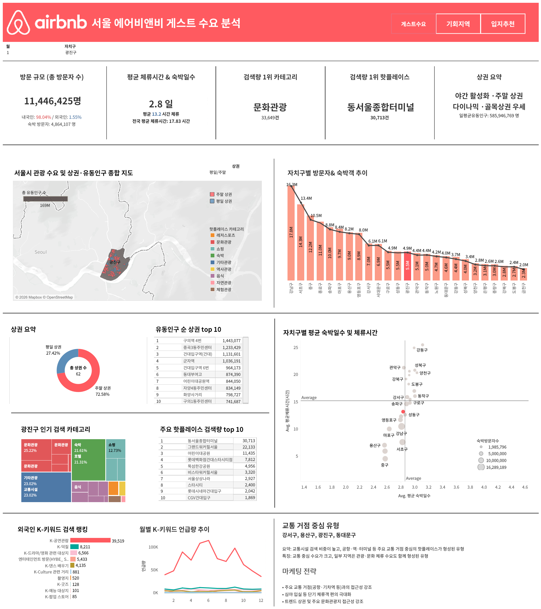
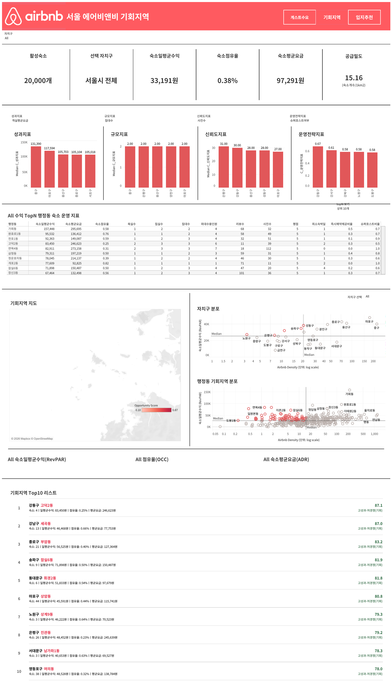
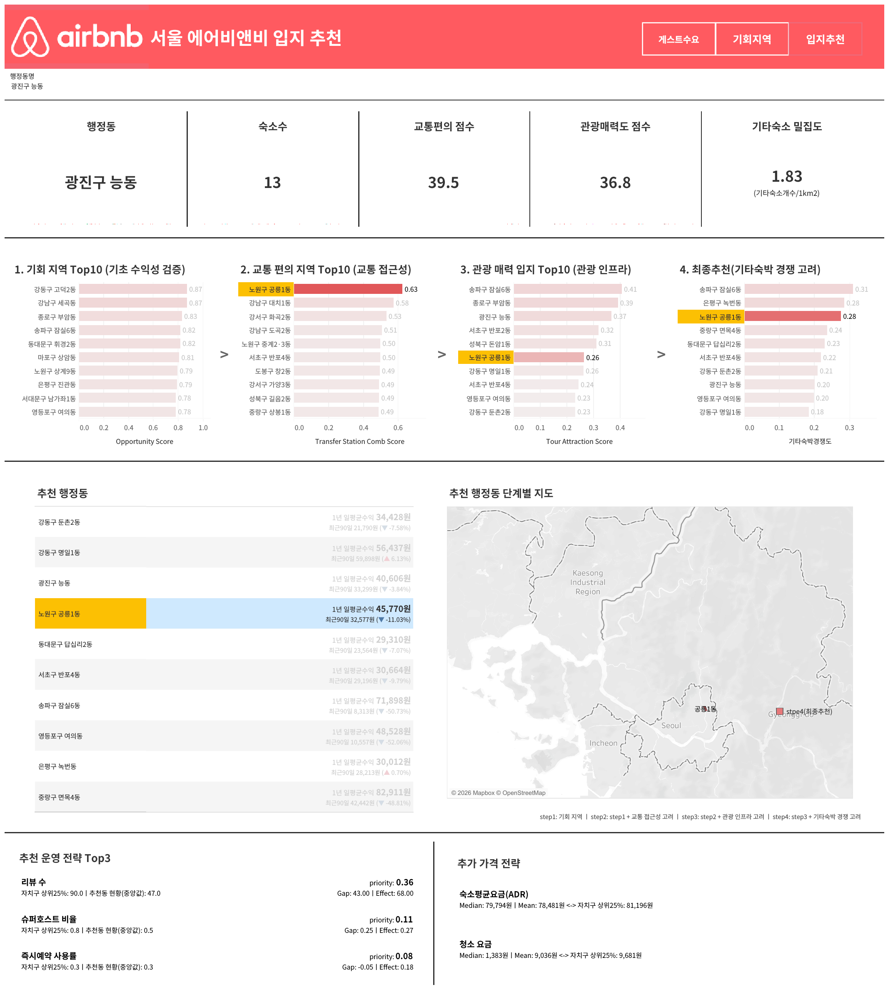

# 데이터로 설계하는 체크인
## Seoul Airbnb Location & Host Strategy Analysis

서울 Airbnb 숙소 데이터와 다양한 공공데이터를 결합하여  
신규 예비 호스트에게 **어디에 진입하고 어떻게 운영해야 하는지**를  
데이터 기반으로 제안한 팀 프로젝트입니다.

---

## Project Context

스파르타 내일배움캠프 데이터분석 10기 과정에서 진행한  
**팀 기반 교육 프로젝트**입니다.

Airbnb 신규 호스트가 서울에서 숙소를 운영할 때 겪을 수 있는  
입지 선정과 운영 전략의 불확실성을 줄이기 위해,

- 게스트 수요
- 숙소 성과
- 지역 특성
- 상권 및 관광 특성
- 교통·인프라

를 종합적으로 분석했습니다.

---

## Business Question

> 신규 예비 호스트는  
> **서울의 어느 지역에 진입하고, 어떻게 운영해야 성공적인 성과를 기대할 수 있을까?**

이를 해결하기 위해 크게 두 가지 관점에서 분석했습니다.

1. **Guest Analysis**  
   지역별 방문객은 누구이며, 어떤 목적으로 방문하고 어떻게 체류하는가?

2. **Host & Location Analysis**  
   어떤 숙소와 지역이 높은 성과를 내며, 신규 호스트에게 어떤 입지가 유리한가?

---

## My Contribution

저는 프로젝트의 **주제 선정 및 문제 정의부터 데이터 전처리,  
게스트 수요 분석, Tableau 시각화까지** 참여했습니다.

### 1. Project Topic & Problem Definition

- 프로젝트 **주제 선정 및 초기 분석 방향 설정에 참여**
- 신규 Airbnb 호스트의 핵심 고민인  
  **"서울의 어느 지역에 진입하고, 어떻게 운영해야 하는가?"**를  
  데이터 분석 문제로 구체화
- 단순 숙소 성과 분석에 그치지 않고 Airbnb 데이터와 공공데이터를 결합하여  
  **게스트 수요와 지역 특성을 함께 분석하는 방향 설정에 기여**

### 2. Data Preprocessing

- Airbnb 및 공공데이터 전처리 과정에 참여
- 분석에 필요한 변수 정리 및 데이터 정제
- 서로 다른 형식의 데이터를 분석 가능한 형태로 가공
- 지역 단위 분석을 위한 데이터 통합 작업 참여

> `notebooks/data_preprocessing.ipynb`에는 팀 전체의 공동 전처리 과정이 포함되어 있습니다.

### 3. Guest Demand EDA

서울 지역별 방문객의 수요와 체류 패턴을 분석했습니다.

주요 분석 내용:

- 자치구별 내·외국인 방문자 구성 및 방문자 수 분석
- 자치구별 평균 숙박일수 및 체류시간 비교
- 중심 지역과 외곽 지역의 체류 패턴 차이 분석
- 자치구별 상권 유형 및 상권 변화 분석
- 평일·주말 및 주간·야간 활성화 특성 분석
- 주요 검색 장소 및 관광 관심 유형 분석
- 지역별 방문 목적과 게스트 수요 특성 도출

분석 결과를 기반으로 지역별 게스트 수요를 다음과 같은 유형으로 정리했습니다.

- **쇼핑·업무 중심**
- **교통 거점 중심**
- **생활 밀착 체류**
- **문화·관광 테마**

### 4. Tableau Visualization

게스트 수요 EDA 결과를 기반으로  
**게스트 관점의 Tableau 시각화 및 대시보드 제작**을 담당했습니다.

- 지역별 게스트 수요 특성 시각화
- 주요 방문 및 체류 지표 비교
- 지역별 수요 특성을 쉽게 비교할 수 있도록 대시보드 구성
- 게스트 수요 분석 결과가 최종 입지 및 마케팅 전략으로 연결될 수 있도록 시각화

---

## Visualization

### Guest Demand Dashboard 01

지역별 방문 및 체류 특성을 비교하여  
서울 내 게스트 수요의 차이를 확인한 대시보드입니다.



### Guest Demand Dashboard 02

상권 및 지역 특성을 활용하여  
지역별 방문 목적과 게스트 수요 특성을 시각화했습니다.



### Guest Demand Dashboard 03

게스트 관점에서 지역별 특성을 종합적으로 비교하여  
지역별 수요 유형과 전략적 특징을 확인할 수 있도록 구성했습니다.



### Final Recommended Areas

숙소 성과, 경쟁 수준, 교통, 관광 및 지역 인프라 등을 종합하여  
신규 Airbnb 호스트의 진입 후보 지역을 도출했습니다.


---

## Data

### Airbnb Data

서울 Airbnb 숙소 데이터의 주요 변수:

- 위치 정보
- 숙소 유형 및 규모
- 최대 수용 인원
- 침실·침대·욕실 수
- 리뷰 및 평점
- 사진 수
- Superhost 여부
- Instant Book 여부
- 최소 숙박일수
- 객실 요금
- Occupancy
- Revenue
- RevPAR

전처리 과정에서 이상치 및 분석에 적합하지 않은 데이터를 정리하여

**32,101건 → 약 20,000건**

의 숙소 데이터를 분석에 활용했습니다.

### Public Data

서울시 및 관련 공공데이터를 결합하여 지역 특성을 분석했습니다.

- 내·외국인 방문자 수
- 숙박 및 체류시간
- 상권 유형 및 상권 변화
- 유동인구
- 주요 관광지 및 공원
- 검색 및 관광 관심 데이터
- 지하철 및 버스 등 교통 인프라
- 호텔·모텔 등 기타 숙박시설
- CCTV 등 안전 관련 데이터

---

## Analysis Workflow

1. 프로젝트 주제 및 문제 정의
2. Airbnb 및 공공데이터 수집
3. 데이터 전처리 및 통합
4. 공간 좌표 변환 및 지역 매핑
5. 게스트 수요 EDA
6. 숙소 특성과 성과 분석
7. 고성과 숙소 특성 비교
8. 자치구 및 행정동 단위 기회지역 분석
9. 숙소 수익 예측 모델링
10. Tableau 대시보드 제작
11. 지역별 운영 및 마케팅 전략 제안

---

## Key Analysis

### 1. Guest Demand Analysis

지역별 방문객 수뿐 아니라  
숙박일수, 체류시간, 상권 특성, 활성 시간대,  
검색 장소 등을 함께 분석했습니다.

#### Key Insights

- 서울 중심부는 숙박 방문자 수가 많지만 상대적으로 숙박일수와 체류시간이 짧게 나타남
- 외곽 지역은 방문자 수는 상대적으로 적지만 장기 체류 및 생활형 수요가 나타남
- 지역에 따라 쇼핑·업무·교통·관광·생활형 등 방문 목적이 구분됨
- 동일한 Airbnb라도 지역별 게스트 특성에 따라 다른 운영 및 마케팅 전략이 필요함

---

### 2. Airbnb Performance Analysis

숙소 성과를 다음 지표를 중심으로 분석했습니다.

- RevPAR
- Occupancy
- ADR
- Revenue

숙소 특성과 성과의 관계를 분석한 결과,  
숙소 규모뿐 아니라

- 리뷰 수
- 사진 수
- 평점
- Superhost 여부
- Instant Book 여부

등 **고객 신뢰 및 운영과 관련된 변수**가 성과와 연결되는 모습을 확인했습니다.

---

### 3. High-Performing Listing Analysis

숙소의 일평균 수익(RevPAR)을 기준으로  
상위 25% 숙소를 **High-Performing** 그룹으로 정의하여  
일반 숙소와 비교했습니다.

주요 차이:

- High-Performing 숙소의 평균 수익이 크게 높음
- Entire Home 비율이 높게 나타남
- 사진 수와 리뷰 수 등 신뢰도 관련 지표에서 차이가 확인됨
- 지역뿐 아니라 숙소 운영 방식 역시 성과에 영향을 미침

---

### 4. Opportunity Area Analysis

숙소의 성과와 경쟁도를 함께 고려하여  
행정동 단위의 신규 진입 기회지역을 분석했습니다.

기회지역 선정에는 다음 요소를 활용했습니다.

- RevPAR
- Revenue
- Airbnb 숙소 밀집도
- Superhost 비율
- Instant Book 비율
- 교통 접근성
- 관광 매력도
- 기타 숙박시설 경쟁
- 유동인구

단계별 필터링을 통해 최종적으로  
**10개의 신규 진입 후보 행정동**을 도출했습니다.

---

### 5. Revenue Prediction

숙소 특성, 운영 변수 및 입지 특성을 활용하여  
숙소 수익 예측 모델을 구축했습니다.

비교 모델:

- Linear Regression
- Random Forest Regressor
- XGBoost

최종적으로 **Random Forest Regressor**를 선정했습니다.

#### Model Performance

- **Test R²: 0.4607**
- **Test MAE: 23,936원**

모델 분석을 통해  
숙소 자체 특성과 운영 전략,  
그리고 입지 관련 변수가 수익 예측에 미치는 영향을 확인했습니다.

---

## Final Recommendations

분석 결과를 기반으로 신규 Airbnb 호스트에게  
다음과 같은 전략을 제안했습니다.

### Location

- 수익성과 경쟁 수준을 함께 고려하여 진입 지역 선정
- 교통·관광·유동인구 등 지역 인프라 고려
- 자치구보다 세부적인 행정동 단위에서 기회지역 탐색

### Listing Strategy

- 사진 수와 리뷰 등 고객 신뢰도 강화
- Instant Book 등 예약 편의 기능 적극 활용
- 지역 및 고객 특성에 적합한 숙소 형태 선택

### Marketing

지역별 게스트 특성에 따라 차별화된 메시지를 제안했습니다.

- 쇼핑·업무 지역 → 접근성 및 업무 편의
- 교통 거점 → 이동 편의 및 유연한 체크인
- 생활 밀착 지역 → 장기 체류 및 로컬 경험
- 문화·관광 지역 → 관광지 및 이벤트 접근성

최종적으로 추천 지역별로

**입지 → 게스트 수요 → 숙소 운영 → 마케팅 → 예상 수익**

을 연결한 전략을 제안했습니다.

---

## Team Analysis

본 프로젝트는 팀 프로젝트로,  
팀원들과 역할을 나누어 다음 분석을 수행했습니다.

- 데이터 수집 및 전처리
- 게스트 수요 분석
- 숙소 및 호스트 성과 분석
- 지역 및 입지 분석
- 행정동 단위 기회지역 선정
- 머신러닝 기반 수익 예측
- Tableau 시각화
- 최종 운영 및 마케팅 전략 도출

이 저장소에는 프로젝트 전체 분석 흐름을 확인할 수 있도록  
**팀에서 사용한 분석 노트북을 함께 공개했습니다.**

---

## Repository Files

### `notebooks/data_preprocessing.ipynb`

Airbnb 및 공공데이터를 분석 가능한 형태로 정제하고  
통합하는 팀 전처리 과정입니다.

저도 일부 데이터 전처리 작업에 참여했습니다.

### `notebooks/guest_demand_eda.ipynb`

지역별 방문객, 체류 패턴, 상권 및 관광 관심도 등을 활용한  
**게스트 수요 분석** 과정입니다.

제가 주요하게 참여한 분석 영역입니다.

### `notebooks/host_performance_eda.ipynb`

Airbnb 숙소 특성, 운영 전략, 수익성과 입지 조건 등을 분석한  
**숙소 및 호스트 관점의 팀 분석**입니다.

### `notebooks/jaehee_eda.ipynb`

제가 수행한 개인 EDA 및 분석 작업을 정리한 노트북입니다.

### `images/`

README에서 사용한 Tableau 대시보드 및  
최종 추천지역 시각화 이미지를 저장한 폴더입니다.

---

## Tools

### Data Analysis
- Python
- Pandas
- NumPy
- GeoPandas
- Shapely

### Statistics & Machine Learning
- Statsmodels
- Scikit-learn
- Random Forest
- XGBoost

### Visualization
- Matplotlib
- Tableau

### Spatial Analysis
- GeoPandas
- Coordinate Transformation
- Administrative District Mapping

---

## Repository Structure

```text
seoul-airbnb-location-analysis/
│
├── README.md
│
├── notebooks/
│   ├── data_preprocessing.ipynb
│   ├── guest_demand_eda.ipynb
│   ├── host_performance_eda.ipynb
│   └── jaehee_eda.ipynb
│
└── images/
    ├── dashboard-01.png
    ├── dashboard-02.png
    ├── dashboard-03.png
    └── final-recommendation-map.png
```

---

## Project Type

- **Educational Team Project**
- Sparta Data Analysis Bootcamp
- Data Analysis 10th Cohort

> This repository contains the analysis files used in the team project.  
> My primary contributions include project topic definition,  
> data preprocessing, guest demand analysis, and Tableau visualization.
